# AADITYA AARYAN

### AI/ML Engineer · Backend Developer · Agentic AI Builder

Building production AI systems — **LLMs · GraphRAG · Multi-Agent · Voice · FastAPI**

 

 

 

  

---

| **Judge-Before-Gen** | **Vector × Graph** | **Zero-Drift Tools** |
|:---:|:---:|:---:|
| Faithfulness-Gated Answers | Memgraph · FalkorDB Fusion | Deterministic Agent Arithmetic |

---

## About

AI/ML engineer focused on **agentic systems**, **hybrid retrieval**, and **production backends**.

Currently building RAG pipelines, real-time voice agents, and graph-augmented document intelligence — with grounding and faithfulness checks wired in before generation, not after.

Open source contributor · MLOps · Available for work

---

## Featured Projects

> Hardest builds — agentic AI, GraphRAG, voice, and production systems.  
> Full portfolio → **[aadik1ng.github.io]([https://aadik1ng.github.io](https://aadik1ng.github.io/)/)**

| # | Project | Focus | Repo |
|:---:|:---|:---|:---:|
| 01 | **Intel-Doc** | Agentic GraphRAG · LangGraph · Memgraph · judge-first grounding | [→](https://github.com/Aadik1ng/Intel-Doc) |
| 02 | **Clinical Intake Agent** | LiveKit voice · Whisper STT · healthcare intake slots | [→](https://github.com/Aadik1ng/Clinical-intake-agent) |
| 03 | **GraphRAG (Lease AI)** | FalkorDB + ChromaDB · legal Q&A · page citations | [→](https://github.com/Aadik1ng/GraphRAG) |
| 04 | **VoiceRAG** | Voice-driven RAG · spoken queries over documents | [→](https://github.com/Aadik1ng/VoiceRAG) |
| 05 | **Ramy · Mortgage ADK** | Google ADK · deterministic EMI/DBR tools · Groq SSE | [→](https://github.com/Aadik1ng/Mortgage_Advisor_ADK) |
| 06 | **Financial Deep Research** | Autonomous multi-step financial research agent | [→](https://github.com/Aadik1ng/Financial_Deep_Research) |
| 07 | **Remote Photoplethysmography** | Heart rate from video · CV + signal processing | [→](https://github.com/Aadik1ng/Remote-Photoplethysmography) |
| 08 | **Context-Aware Retrieval** | Hybrid search · query rewriting · relevance scoring | [→](https://github.com/Aadik1ng/Context-Aware-Retrieval-Engine) |

<b>Intel-Doc</b> — deep dive

**Use case:** Enterprise document Q&A with <5% hallucination target.

**Architecture:** Agentic LangGraph → hybrid vector + graph (Memgraph) → judge-first validation → grounded generation

**Stack:** `LlamaIndex` · `LangGraph` · `Memgraph` · `LiteLLM` · `FastAPI` · `Streamlit`

<b>Clinical Intake Agent</b> — deep dive

**Use case:** Dual-mode healthcare intake — text chat and real-time voice.

**Architecture:** FastAPI · Streamlit · LiveKit WebRTC · Whisper STT · OpenAI TTS · Azure OpenAI

**Stack:** `FastAPI` · `LiveKit` · `Whisper` · `LiteLLM` · `Docker`

<b>GraphRAG (Lease AI)</b> — deep dive

**Use case:** Multi-document lease analysis with structured extraction and cited Q&A.

**Architecture:** FalkorDB + ChromaDB hybrid → FastAPI → Google ADK chat

**Stack:** `Google ADK` · `FalkorDB` · `ChromaDB` · `FastAPI` · `Docker`

---

## Agentic Stack

  
  
  
  
  
  
  

---

## Tech Stack

    
    
    
  

  
  
  
  
  
  
  
  

---

## GitHub Analytics

---

### Connect

  

**Building:** faithfulness-gated RAG · cyclic agent loops · voice intake pipelines · graph-vector fusion

  

<b>Aaditya Aaryan</b> 
<a href="https://aadik1ng.github.io/">aadik1ng.github.io</a> · Turning ideas into intelligent, production-ready systems

